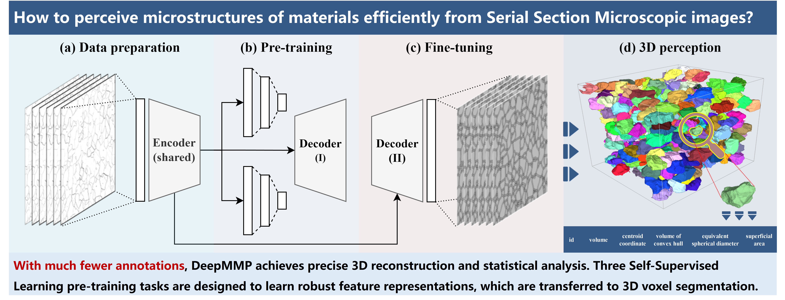

# DeepMMP

In this work, we propose the DeepMMP framework to efficiently perceive microstructures of materials from Serial Section Microscopic images.

Below are highlights of our work:
- The intrinsic spatial nature of Serial Section Microscopic images is identified.
- The continuity and similarity of 3D volumetric SSM data are implicitly modeled.
- The proposed DeepMMP framework delivers a prominent improvement in segmentation.
- The much fewer annotations are needed to train Convolutional Neural Networks.
- The pipeline of accurate and efficient 3D perception is established.

Codes and data will be released when the paper is published.